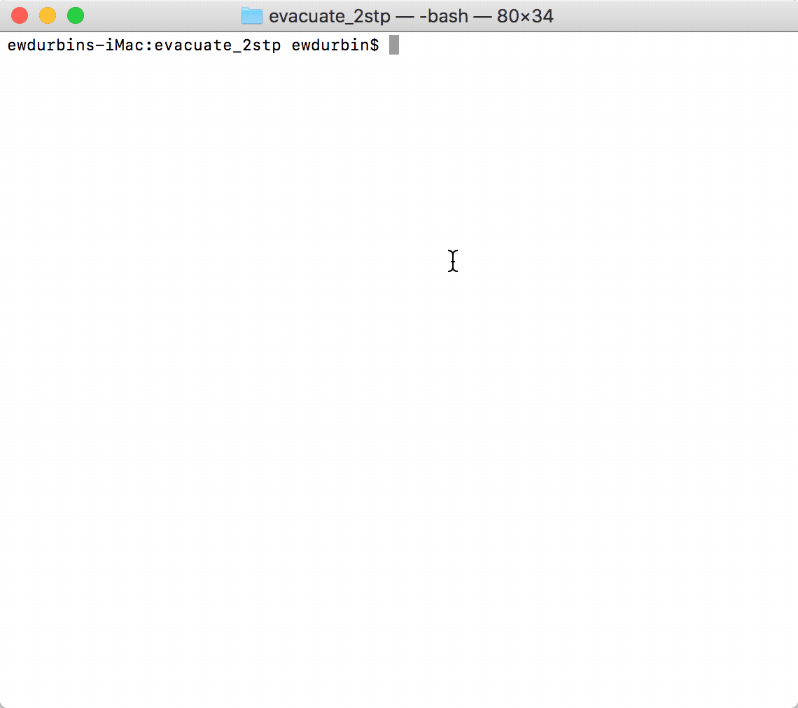

# evacuate_2stp

Unfortuantely [the maintainer of 2STP](https://github.com/thomasrzhao) [announced end of support for 2STP](http://thomasrzhao.com/2stp-support/end-of-support/) in September 2016.

With the release of iOS 11.2.1, the UI for 2STP has begun to degrade. Sending me and many others on a search for a new app for 2FA.

This tool allows for decrypting the encrypted backups created by 2STP.

If you're looking for a new iOS app, I'd reccommend [OTP Auth](http://cooperrs.de/otpauth.html). It provides a similar experience, shows rapid progress, and has proactive support similar to that provided by 2STP. As a bonus, the backup file format and encryption is well documented over at [CooperRS/decrypt-otpauth-files](https://github.com/CooperRS/decrypt-otpauth-files), allowing you the freedom to migrate your codes to a new app if the [author gets hired by Apple](http://thomasrzhao.com/2stp-support/end-of-support/).

## Usage

Requires:

  - [Python 3.6](https://www.python.org/downloads/)
  - :cake: [`pipenv`](https://docs.pipenv.org) :cake:
  - An encrypted 2STP export file<sup>[1](#footnote1)</sup>

```
git clone https://github.com/ewdurbin/evacuate_2stp.git
cd evacuate_2stp
pipenv install
pipenv run python decrypt_2STP.py --encrypted-2stp-export <path to your 2STP export>
```

<a name="footnote1">1</a>: See "Can I migrate my account data to another authenticator app?" section of [the end of support accouncement](http://thomasrzhao.com/2stp-support/end-of-support/) for details on generating this export.

## Demo

A demo file `demo.2stp` is available for testing, it's password is `test`


